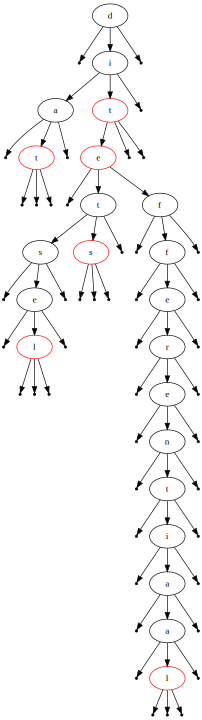

# Autocomplete

## Introductie

In veel applicaties is het niet meer weg te denken: auto-complete. Na slechts enkele
karakters in te geven krijg je volledige lijst met voorstellen waarvan de getypte
letters een prefix zijn.

Een erg efficiente oplossing om dit te implementeren is een ternaire zoekboom.

De klasse TernaireZoekboom in [src/ternaire-zoekboom.cpp](src/ternaire-zoekboom.cpp) implementeert de nodige functies die op de hele datastructuur zullen gebruikt worden (toevoegen, zoeken, tekenen, ...). Elke knoop in de boom zal voorgesteld worden door een element van de Klasse TZKnoop. Een knoop houdt zijn kinderen, één karakter en een bool bij om te kunnen nagaan of een prefix van een woord ook in de zoekboom voorkomt of niet. (vb. `voor` en `voorbeeld` zitten in de zoekboom, maar `voorb` niet).

Een voorbeeld van een ternaire zoekboom waar achtereenvolgens de woorden: `dit`, `dat`, `diets`, `diesel`, `differentiaal` en `die` zijn toegevoegd vind je hieronder. Begin met deze ternaire zoekboom op papier op te bouwen.



## Woorden aan ternaire zoekboom toevoegen en zoeken

1. Implementeer de `void voegtoe(string woord)` functie om een woord aan een ternaire zoekboom
   toe te voegen.

**Opmerking:** Duplicate sleutels zijn niet toegelaten in de boom. Als er toch duplicate
sleutels toegevoegd worden, moet er een `runtime errror` optreden: (`throw std::runtime_error("sleutel bestaat al");`)

**Tip:** De ternaire zoekbomen kunnen getekend worden met de functie `teken(const char* bestandsnaam) const` in dot formaat en weergegeven worden met de VSCode extensie [`Graphviz Interactive Preview `](https://marketplace.visualstudio.com/items?itemName=tintinweb.graphviz-interactive-preview).

2. Implementeer de `bool zoek(string woord)` funtie die als resultaat teruggeeft of een woord
   aldanniet in de zoekboom zit.

## Toepassing 1: Autocomplete met de woordenlijst

Tijdens het opstellen van een bericht, zal je computer mogelijke woorden voorstellen die beginnen met de letters die je op dat moment al getypt hebt. Hiervoor wordt een woordenlijst ingeladen in een ternaire zoekboom.

3. Implementeer `vector<string> auto_complete(string prefix)` die een lijst met woorden teruggeeft waarvan de opgegeven string een prefix is. Geef deze terug in alfabetische volgorde. We veronderstellen dat een woord een prefix is van zichzelf, eg. `voor` is ook een prefix van `voor`.

## Toepassing 2: Productcodes

De werknemers van de magazijn-afdeling zijn erg tevreden met de auto-complete functie die je
toevoegde in het productcode-veld. Ze vragen of het mogelijk is om voor enkele letters een
wildcard toe te laten.

Enkele voorbeelden van productcodes:

```
RD-R9250
FD-R9250
BT-DN300
EW-EC300
CS-R9200
BR-R9270
ST-R9270
```

De zoekopdracht `??-R92` dient in dit geval volgende vijf resultaten te bevatten:

```
RD-R9250
FD-R9250
CS-R9200
BR-R9270
ST-R9270
```

4.  Implementeer `vector<string> auto_complete_wildcard(string prefix)` waarbij je
    het karakter `?` als wildcard toelaat.
