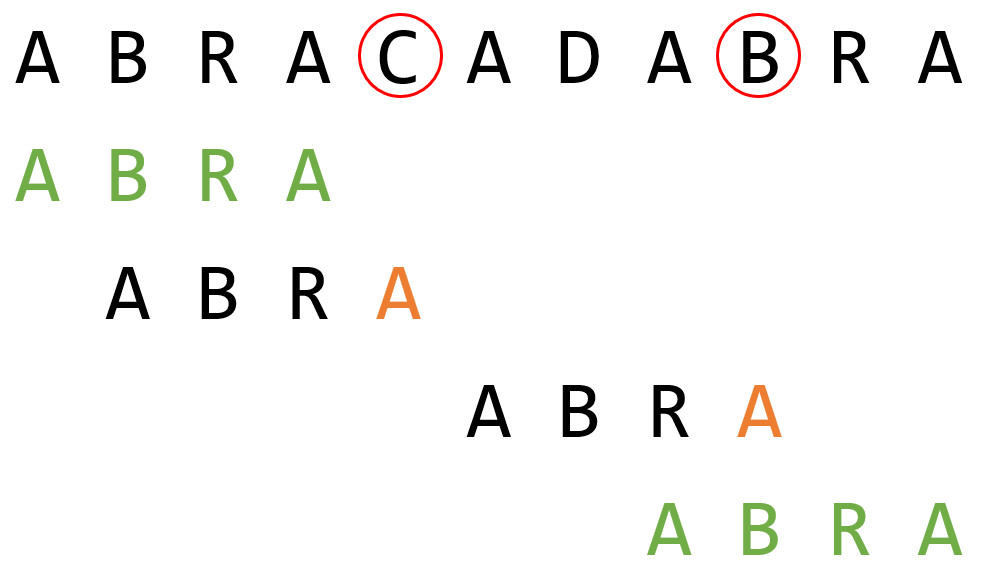
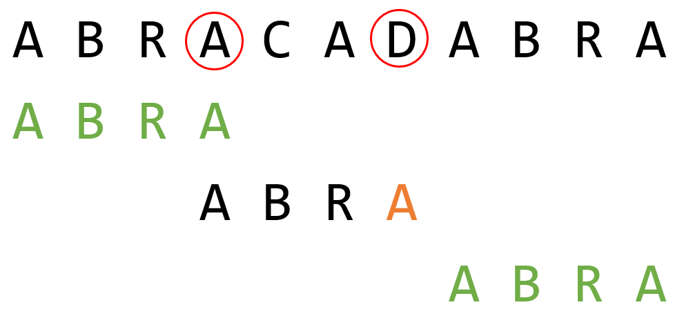
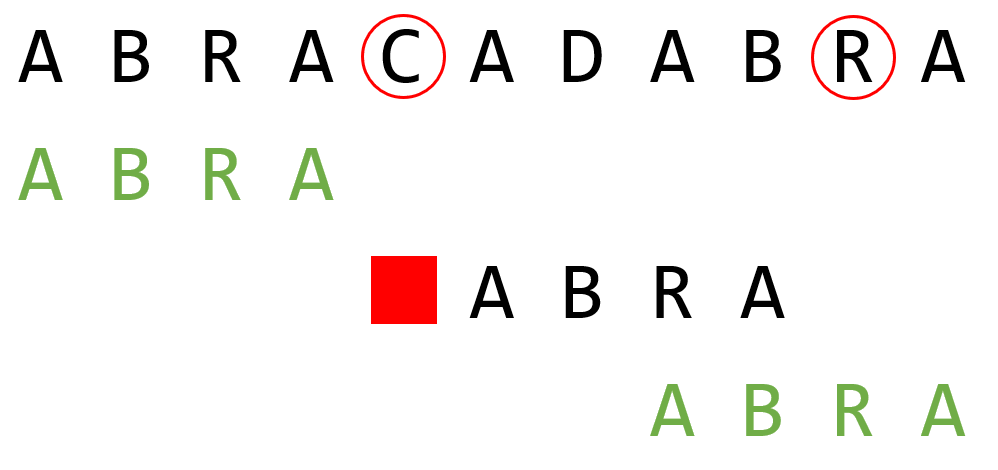

# Boyer-Moore

In dit labo implementeren we het *substring search* algoritme van Boyer-Moore, 

In de theorieles werd de *heuristiek van het verkeerde karakter* besproken. 
Dit is ook de heuristiek die we in dit labo zullen implementeren, alsook enkele 
eenvoudige varianten hiervan die de performantie ervan verbeteren.

Een meer performante implementatie, aan de hand van de *heuristiek van de goede suffix*
laten we voor de gemotiveerde lezer.

## Opgave

Bij dit algoritme moet er preprocessing gebeuren op het patroon (*de naald*) die gezocht zal worden.
Eenmaal deze preprocessing gebeurd is, kan dit werk hergebruikt worden om de *naald* in verschillende
strings (*hooibergen*) terug te vinden.

De hoofding van de klasse vind je in [`boyermoore.h`](include/boyermoore.h) en ziet er als volgt uit:

```cpp
/**
 * Deze klasse gebruikt enkel de heuristiek van het verkeerde karakter 
 */
class BMVerkeerdeKarakter
{
public:
    BMVerkeerdeKarakter(const string &naald);
    std::queue<int> zoek(const string &hooiberg);

    /**
     * Deze variabele wordt ingevuld met het aantal karaktervergelijkingen dat nodig was in de laatste zoek-opdracht
     */
    long int laatsteAantalKaraktervergelijkingen;

private:
    string naald;
    std::array<int, ALFABET_GROOTTE> verkeerdeKarakter;

};
```

Je ziet dat de zoek-functie een queue teruggeven met plaatsen: je gebruikt de methode meestal om alle
plaatsen waar de naald voorkomt op te zoeken. Meestal worden die plaatsen daarna in volgorde verwerkt. 
Dus gebruik je een queue en geen gewone list.

### Enkel met heuristiek van het verkeerde karakter

In normale omstandigheden is het de eerste heuristiek die ervoor zorgt dat Boyer-moore snel is. 
Gebruik in een eerste versie alleen de eerste heuristiek: die van het verkeerde karakter:

```cpp
std::queue<int> BMVerkeerdeKarakter::zoek(const string& hooiberg);
``` 

Om te testen of je de implementatie zo effient als mogelijk is, hou je bij hoeveel keer je een 
karaktervergelijking doet tussen naald en hooiberg. Sla dit op in het veld `laatsteAantalKaraktervergelijkingen`. 

Voor de heuristiek van het verkeerde karakter dien je een tabel op te stellen die de laatste index van elk 
karakter in de *naald* bijhoudt. Gegeven de *naald* ABRA, ziet een correcte tabel met karakter indexen er
uit als volgt:

| **Letter** | **Index** |
|------------|-----------|
| A          | 3         |
| B          | 1         |
| R          | 2         |
| ...        | -1        |

Bij het zoeken van ABRA in ABRACADABRA gebeuren de volgende verschuivingen:




### Variant van Horspool

Bij de variant van Horspool passen we tabel met karakter indexen aan zodat we de
meest rechtse positie van elk karakter in de naald bijhouden **behalve het laatste karakter**.

Voor de *naald* ABRA levert dit de volgende tabel op:

| **Letter** | **Index** |
|------------|-----------|
| A          | **0**     |
| B          | 1         |
| R          | 2         |
| ...        | -1        |

Bij een mismatch tussen *naald* en *hooiberg* kijken we nu niet langer naar het karakter uit de hooiberg waarop
de mismatch gebeurde, maar gebruiken we steeds het karakter van de *hooiberg* dat uitgelijnd staat met het 
laatste karakter van de *naald*.

Het karakter uit de *hooiberg* dat wordt opgezocht in de tabel staat aangeduid met een rode cirkel in onderstaande
afbeelding.



Een voordeel van deze variant is dat het niet meer mogelijk is dat de index van het opgezochte karakter *rechts*
ligt van de positie waar de mismatch gebeurde. Je kan de *naald* dus steeds naar rechts opschuiven, en moet geen
uitzondering meer implementeren.

Kopieer je code van `BMVerkeerdeKarakter` naar `BMHorspool` in [`bm_horspool.cpp`](src/bm_horspool.cpp), en pas
deze aan om de variant van Horspool te implementeren.

### Variant van Sunday

De variant van Sunday is gelijkaardig aan die van Horspool, met twee aanpassingen:

1. We gebruiken we de originele tabel van de *heuristiek van het verkeerde karakter*.
2. Bij een mismatch vergelijken we het karakter in de hooiberg dat uitgelijnd staat **juist voorbij het einde
   van de naald**. 



Kopieer je code van `BMVerkeerdeKarakter` naar `BMSunday` in [`bm_sunday.cpp`](src/bm_sunday.cpp), en pas
deze aan om de variant van Horspool te implementeren.

## Benchmarking van de implementaties

Hoeveel karaktervergelijkingen verschil zit er tussen de verschillende varianten? 