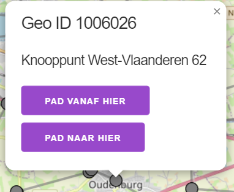
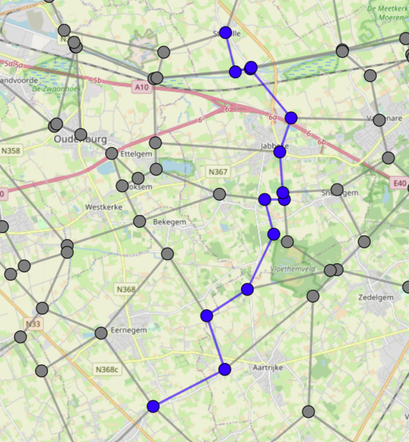
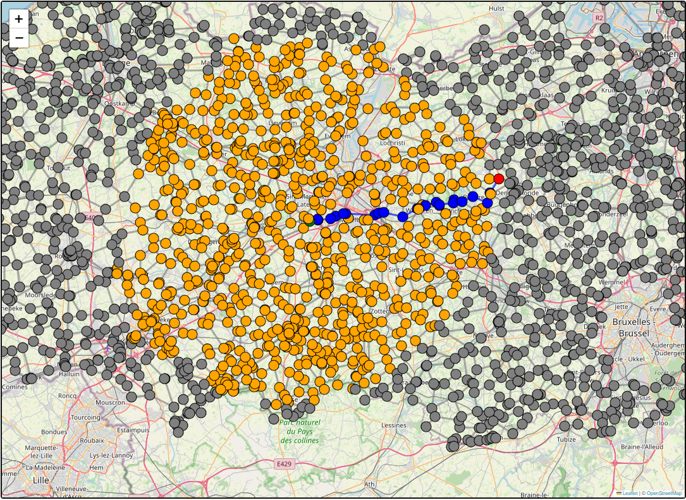
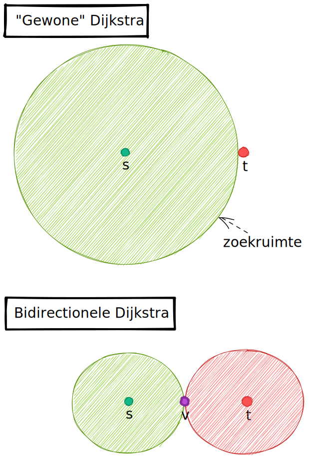
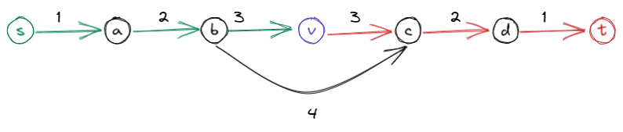
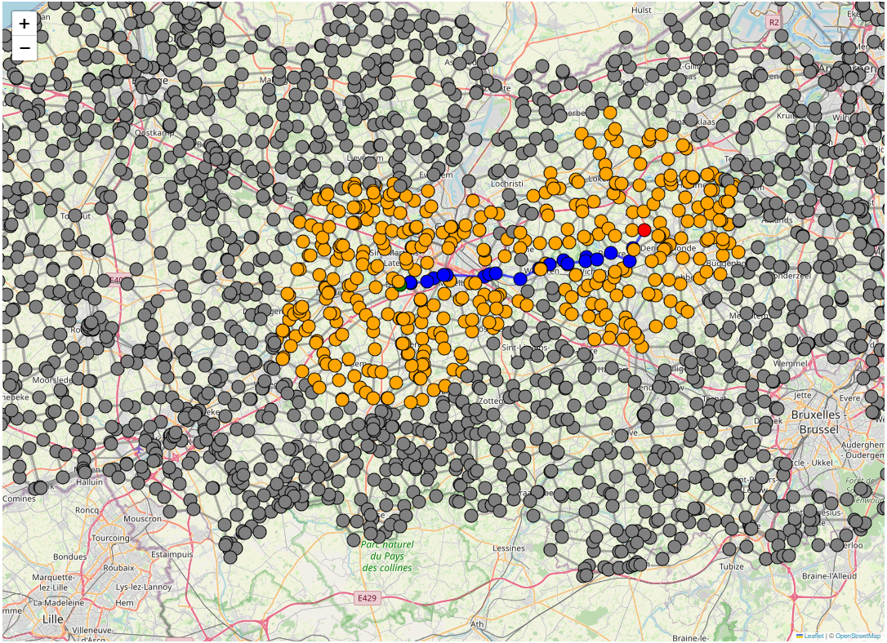

# Fietsknooppunten: Kortste paden

In dit labo implementeren we het algoritme van Dijkstra om het kortste pad te vinden tussen twee
fietsknooppunten.

## Opgave

Implementeer de functie `kortstePad` in [src/fietsnet.cpp](src/fietsnet.cpp) die het kortste pad bepaalt
tussen twee gegeven knoopnummers:

```cpp

struct KortstePadStap {
    int knoopnr; 
    int tak_nr; // tak waarmee deze knoop werd bereikt, -1 voor startknoop
    double totale_afstand; //totale afstand in meters die werd afgelegd
};

std::list<KortstePadStap>
kortstePad(const KnooppuntGraaf &g, int start_nr, int eind_nr)
{ 

}

```

Gebruik een [std::priority_queue](https://en.cppreference.com/w/cpp/container/priority_queue) om te bepalen
wat de volgende knoop is uit je tijdelijke verzameling die je permanent moet maken. Merk op dat deze priority
queue het **grootste** element teruggeeft: implementeer je vergelijkingsfunctie correct om hier rekening mee te houden!

Je kan je code testen aan de hand van enkele tests in gedefineerd in [test/test.cpp](test/test.cpp). 
Gebruik de `Run CTest` knop in je blauwe balk onderaan hiervoor.

## Webinterface

We hebben opnieuw een eenvoudige webinterface voor jou geimplementeerd.

Surf na het starten van de webserver naar http://localhost:8080 . Klik op een die je wil aanduiden
als begin- of eindpunt. Kies hierbij "Pad vanaf hier" of "Pad naar hier".



Van zodra zowel een begin- als eindpunt werd aangeduid, zal het kortste pad worden berekend. Dit gebeurt
mbv een API-call naar `/api/kortste_pad/:start_geoid/:eind_geoid`.

Bij een correcte implementatie zal het kortste pad in het blauw worden aangeduid op de kaart:




Ter herinnering:

- De `www`-folder wordt verondersteld aanwezig te zijn in de _working directory_ van het process dat wordt
 uitgevoerd. Krijg je 404 foutmeldingen? Controleer dan of je programma werd gestart in de juiste folder 
 (= de `build/` folder).
- Je moet de webserver expliciet zelf moet stoppen (CTRL+C) vooraleer je opnieuw compileert/het programma opnieuw kan starten.

## Extra visualisatie: Permanente knopen

Om het debuggen te vergemakkelijken, werd een globale variabele `permanente_knoopnrs` gedefinieerd in `fietsnet.h`.
Sla hier de knoopnummers (van de graaf) in op die tijdens het uitvoeren van het Dijkstra-algoritme permanent werden gemaakt.

Pas hiervoor volgende code aan, en voeg deze op het einde van je `kortstePad` implementatie:

```cpp

    permanente_knoopnrs.clear();
    for(<itereer over je permanente knoopcollectie>){
        permanente_knoopnrs.push_back(knoop_nr);
    }

```

De webserver heeft een API-route `/api/permanente_knopen` die de (graaf-)knoopnummers omzet in de overeenkomstige geoids, 
zodat deze kunnen worden gevisualiseerd op de website.



## Optimalisatie: Bidirectionele Dijkstra

Aangezien we slechts het kortste pad zoeken tussen 2 knopen, is het niet bepaald efficient om de volledige 
kortste-pad-boom op te stellen vanuit de startknoop.

Bidirectionele Dijkstra is een optimalisatie van het Dijkstra-algoritme, waarbij
er niet enkel vanuit de beginknoop 'vooruit' wordt gezocht, maar ook 'achteruit'
vanuit de eindknoop.
Een visueel voorbeeld van waarom dit voordelig is zie je hieronder. De gearceerde
bollen stellen de zoekgebieden voor waarin knopen worden gesettled. Bij
bidirectioneel zoeken is de gezamelijke oppervlakte van de twee bollen kleiner dan
de ene bol bij gewone Dijkstra.




Om dit te implementeren dient Dijkstra als volgt aangepast te worden:

- Houd in de tijdelijke verzameling niet enkel het label van de knoop bij, maar 
  ook of dit knoop via voorwaarts of achterwaarts zoeken bereikt was;

- Voeg initieel zowel de beginknoop als eindknoop toe aan de initiele verzameling;

- Als een knoop zowel voorwaarts als achterwaarts aan de permanente verzameling werd
  toegevoegd, dan is het kortste pad gevonden.

  Echter, dit is niet noodzakelijk het pad dat loopt door deze gemeenschappelijke 
  permanent gemaakte knoop!!!

  Bekijk onderstaand voorbeeld: alhoewel knoop `v` als eerste in zowel de voorwaartse als
  achterwaartse zoektocht zal worden gesettled, loopt het korste pad toch niet door
  deze knoop.

  

  De juiste manier om het kortste pad te vinden is:

  * Bekijk elke combinatie van een voorwaarts permanent gemaakte knoop `a` en achterwaarts
    permanent gemaakte knoop `b`;
  * Als er een tak `(a,b)` bestaat, bereken dan `permanente_kost(a) + kost((a,b)) + permante_kost(b)`
  * Het pad met de laagste kost die je op deze manier berekent is het echte kortste pad. 

Kopieer je werkende Dijkstra-implementatie van `kortstePad` naar `kortstePadBidirectioneel`. 
Pas vervolgens je code aan zoals hierboven beschreven. 

Indien correct geimplementeerd, dan ziet de permanente knopen visualisatie er als volgt uit:



### Analyse
Hoe verhoudt het aantal permanent gemaakte knopen zich tov je eerste Dijkstra-implementatie? 
Komt dit overeen met wat je verwacht? 
Bereken de verwachtte verhouding aan de hand van de stralen van het zoekgebied/de zoekgebieden. 
Hoe evolueert deze verhouding in relatie met de afstand tussen begin- en eindknoop?

