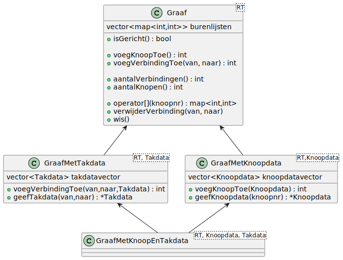

# `graaf.hpp`

Je krijgt een header [`graaf.hpp`](include/graaf.hpp). Het bestand bevat definities en code voor verschillende klassen van ijle grafen.

In een typische objectgeoriënteerde aanpak zou men een klasse Knoop en een klasse Verbinding (of Buur) maken die een pointer naar een Knoop bevat. In deze implementatie werken we echter met _nummers i.p.v. pointers_. De knopen (Eng. _nodes_) worden genummerd van 0 tot `n-1`, en ook de verbindingen (Eng. _edges_) krijgen nummers (die, als er verwijderd wordt, niet meer noodzakelijk op mekaar volgen). De graaf houdt een `std::vector` van knopen bij. Elke knoop is een burenlijst gedefinieerd als `std::map<int,int>` die doelknoopnummers afbeeldt op verbindingsnummers:


Het voordeel van een nummeringssysteem is dat men eenvoudig data met knopen of verbindingen kan associëren zonder iets aan de graafimplementatie te moeten veranderen. Zo kan men bv. een tabel of vector van pre-ordernummers maken, die men indexeert met knoopnummers. Verbindingsgewichten kunnen ook ondergebracht worden in een aparte tabel of vector, geïndexeerd d.m.v. verbindingsnummers. Enzovoort.

De nummeringen zouden eigenlijk met `unsigned int` (of `size_t`) moeten gebeuren, want ze worden gebruikt om te indexeren in tabellen en vectoren. Er is echter voor `int` gekozen omdat men in graafalgoritmen vaak handig gebruik maakt van _speciale_ nummers zoals -1, bv. om aan te duiden dat een verbinding niet bestaat.

Bij de constructie van een `Graaf` moet je een `RichtType` meegeven, hetzij `GERICHT` of `ONGERICHT`. Het verschil zit hem bij het toevoegen van een verbinding. Indien je een verbinding a->b toevoegt aan een ongerichte graaf, dan wordt automatisch de verbinding b->a ook toegevoegd. Interessant is dat beide verbindingen hetzelfde verbindingsnummer krijgen! Op die manier kun je data, zoals een gewicht, associëren met "beide richtingen" van een ongerichte verbinding.

Bij de constructie van een `Graaf` kun je een aantal knopen opgeven. Default is dit nul. Je kunt achteraf nog knopen toevoegen met de methode `voegKnoopToe()`. Deze methode geeft het knoopnummer van de nieuwe knoop terug. In deze implementatie kun je de nummering niet wijzigen en kun je geen knopen verwijderen. Verbindingen moeten toegevoegd worden met `voegVerbindingToe(a,b)`. Je kunt ook verbindingen verwijderen met `verwijderVerbinding`.

Let op de implementatie van de operator[], die ervoor zorgt dat een graaf zich voordoet als een tabel van knopen (waarom de twee versies ?!). Een knoop is een `map<int, int>`. Om buren te overlopen moet je een iterator gebruiken, meer bepaald `Knoop::iterator`. De waarde van een map-iterator is een paar, in dit geval `pair<int, int>`. Dat is een struct met twee velden: `first` slaat hier op het knoopnummer van de buurknoop en `second` op het nummer van de verbinding.

**Tip:** een nette manier om de verbindingen van een knoop te overlopen is als volgt:

```cpp
for(const auto&[buur_nr,tak_nr]: graaf[knoop_nr]){
    cout << knoop_nr << " is met " << buur_nr << " verbonden via tak " << tak_nr << endl;
}
```

Verschillende graafmethodes zijn `const`. Deze mogen de graaf niet wijzigen. Als het nodig is om buren te overlopen moet je in dat geval `Knoop::const_iterator` gebruiken.

Sommige methodes gooien een `GraafExceptie` op indien er iets foutgaat. Deze klasse erft van `std::logic_error` en indirect van `std::exception`.

## Knoop- en takdata

Om naast de structuurinfo van een netwerk ook nog andere relevante info per knoop en/of verbinding bij te houden werden de volgende subklassen geimplementeerd:

```cpp
GraafMetTakdata<RichtType,TakDatatype>
GraafMetKnoopdata<RichtType,KnoopDatatype>
GraafMetKnoopEnTakdata<RichtType,KnoopDatatype,Takdatatype>
```

Deze klassen breiden `voegKnoopToe` en/of `voegVerbindingToe` uit met een extra parameter om knoop/verbindingsdata door te geven. Het opvragen van de data gebeurt via de functies `geefKnoopdata` en/of `geefTakdata` die een _pointer_ naar de data teruggeven.

## Overzicht van de Graaf-klassen en hun belangrijkste functies:

