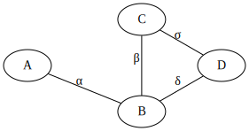

# Fietsknooppunten 

## Introductie

In dit inleidende labo verkennen we het gebruik van de klasse 'Graaf' die we in de 
komende labo's nog verschillende keren zullen terugzien.

Wie fietst langs Vlaamse wegen, komt wel eens een bordje van het fietsknooppuntennetwerk
tegen. In Vlaanderen staan er bijna 4000 bordjes die je helpen om zelf een mooie 
fietstocht in elkaar te knutselen. Elk fietsknooppunt heeft een nummer, en toont de juiste
richting om naar naburige knooppunten te fietsen. 


Via het open dataportaal van de Vlaamse Overheid kan je het volledige netwerk 
[downloaden](https://opendata.vlaanderen.be/dataset/toeristisch-recreatief-fietsnetwerk-vlaanderen).

In dit labo:

- lezen we de data van het fietsknooppuntennetwerk in, en stellen ermee een graaf op;
- visualiseren we deze graaf in een webinterface;
- implementeren we het "breedte eerst zoeken" algoritme.

## Data inlezen
### De klasse `Graaf`

Lees de documentatie van de graaf-klassen in [DOCUMENTATIE.graaf.md](DOCUMENTATIE.graaf.md).

**Opdracht**: schrijf op papier de burenlijsten uit voor onderstaande grafen:




*Tip*: lees bij twijfel de code van de klasse `Graaf`. Zo is de functie 
`voegVerbindingToeInDatastructuur` anders geimplementeerd voor gerichte en ongerichte
grafen.


### Opgave

Om jullie het leven gemakkelijker te maken hebben we de bestanden van het open dataportaal 
verwerkt tot eenvoudig in te lezen CSV-bestanden.

`knooppunten.csv` ziet er uit als volgt:

```
geoid,knoopnr,naam,lat,lon
612,1,FNW,51.07229293231546,4.374126102517058
614,12,Vlaamse Ardennen,50.83265242783213,3.748641218834394
615,99,Vlaamse Ardennen,50.78025173981817,3.747855072612591
```

Elke regel stelt een bordje voor, voorzien van een bepaald knoopnummer, de naam van het 
fietsknooppuntnetwerk (typisch de naam van de regio), en de exacte locatie (latitude en 
longitude).

`trajecten.csv` bevat informatie over de verbindingen (start, eind, lengte):

```
begin_geoid,end_geoid,lengte_m
10001,10000,2417.4406439898253
10001,10191,1192.8739262976499
10002,10188,870.4760795997952
```

**Opgave:** Vul de functie `leesGraaf` in [src/fietsnet.cpp](src/fietsnet.cpp) aan om de graaf in te lezen.

Deze functie geeft zowel een KnooppuntGraaf terug, als de afbeelding van de 'geoid' van elk bordje op 
zijn equivalente knoopnummer in de graaf.

```cpp
/**
 * @brief Een KnooppuntGraaf heeft knoopdata van het type 'Fietsknooppunt' en 
 * takdata van het type `double` (=lengte van verbinding)
 */
typedef GraafMetKnoopEnTakdata<ONGERICHT, Fietsknooppunt, double> KnooppuntGraaf;


struct KnooppuntGraafMetInfo {
    KnooppuntGraaf graaf;
    std::map<int, int> geoids; //afbeelding van geoids op knoopnrs in graaf
};

KnooppuntGraafMetInfo leesGraaf(){

    KnooppuntGraaf g;
    std::map<int, int> geoid_naar_knoopnr;

    ...

    return {g, geoid_naar_knoopnr};
}

```

Je kan je code testen aan de hand van enkele tests in gedefineerd in [test/test.cpp](test/test.cpp). Gebruik de `Run CTest` knop in je blauwe balk onderaan hiervoor.


## Webinterface

In [src/webserver.cpp](src/webserver.cpp) hebben we een eenvoudige webserver geimplementeerd voor jou, ook
de serialisatie van alle datastructuren nemen we voor onze rekening in [src/serializer.cpp](src/serializer.cpp).

De webserver doet 3 zaken:

- `/graaf.geojson` geeft een GeoJSON-representatie terug van de opgesteld `KnooppuntGraaf`;
- `/api/breedte_eerst_zoeken/:start_geoid/:max_diepte` voert het breedte eerst zoeken-algoritme uit vanaf de gegeven geoid, voor een opgegeven diepte;
- alle andere requests worden afgehandeld door in de `www` folder te zoeken naar de gevraagde resource.

Merk op dat de `www`-folder wordt verondersteld aanwezig te zijn in de _working directory_ van het process dat wordt uitgevoerd. Krijg je 404 foutmeldingen? Controleer dan of je programma werd gestart in de juiste folder (= de `build/` folder).

Na het starten van de webserver kan je de webinterface bezoeken op http://localhost:8080 . Merk op dat je 
de webserver expliciet zelf moet stoppen (CTRL+C) vooraleer je opnieuw compileert/het programma opnieuw kan starten.

## Breedte eerst zoeken

Implementeer nu het _breedte eerst zoeken_ algoritme in [src/fietsnet.cpp](src/fietsnet.cpp).

Deze functie heeft als resultaat een vector met `GraafZoekStap` objecten terug:

```cpp
struct GraafZoekStap {
    int geoid; // geoid van de bezochte knoop
    int tak_nr; // tak waarmee deze knoop werd bereikt, -1 voor startknoop
    int diepte; // aantal stappen nodig om tot aan deze knoop te komen, 0 voor de startknoop
};

std::vector<GraafZoekStap> breedte_eerst_zoeken(const KnooppuntGraaf& g, int start_nr, int max_diepte){

    std::vector<GraafZoekStap> resultaat;

    // VUL AAN

    return resultaat;
}

```

De pseudo-code voor breedte-eerst zoeken is als volgt gedefineerd in de theorie (cfr. Algoritme 1 op pagina 12 van Gevorderde Algoritmen, Grafen, Deel I):


Als je dit juist hebt geimplementeerd, dan kan je volgende visualisatie bekomen:


