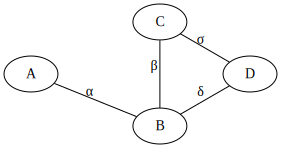
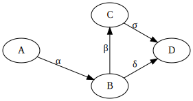
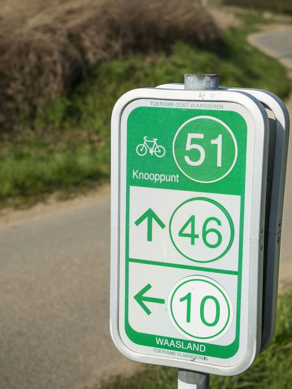
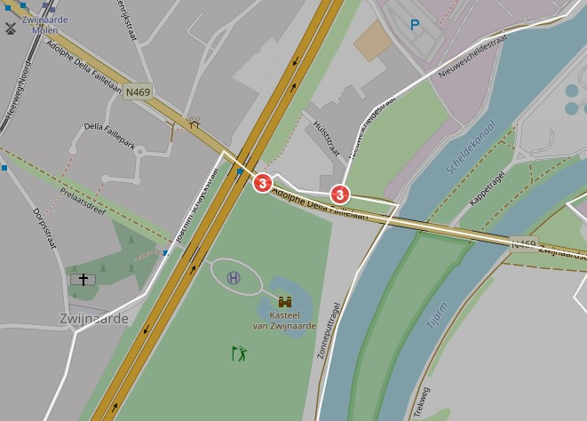
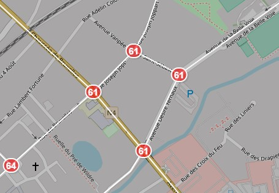

# Fietsknooppunten 

## Introductie

Netwerken vind je in het dagelijkse leven in alle geuren en kleuren: sociale netwerken, 
computernetwerken, het wegennetwerk, etc. In essentie kan je ze altijd herleiden tot 
"dingen die met elkaar verbonden zijn".

Een belangrijk onderwerp in het vak Gevorderde Algoritmen zijn 'Grafen'. Deze laten ons
toe om zulke netwerken te modelleren en de oplossing te zoeken tot veelvoorkomende 
vragen, zoals "wat is de kortste weg van A naar B" ?

In dit inleidende labo verkennen we het gebruik van de klasse 'Graaf' die we in de 
komende labo's nog verschillende keren zullen terugzien.

### De klasse `Graaf`

Een graaf bestaat uit knopen die met elkaar verbonden zijn via verbindingen (ook 
*takken* genoemd).
In de klasse `Graaf` houden we per knoop bij met welke andere knopen deze verbonden is.
Informatie over de knopen en verbindingen wordt in vectoren bijgehouden, zodat we deze
gemakkelijk op index-nummer kunnen opzoeken.

Per knoop wordt verbindingsinformatie in een `Burenlijst` opgeslagen:

```cpp
typedef std::map<int, int> Burenlijst;
```

Een `Burenlijst` beeldt het knoopnummer van de buur af op het nummer van de verbinding.

In de klasse `Graaf` houden we in `vector<Burenlijst> burenlijsten` op die manier alle
informatie bij over de vorm van een graaf.

Een verbinding kan gericht of ongericht zijn, wat aangeeft of je deze enkel in een
bepaalde richting mag doorlopen of niet. De klasse `Graaf` geeft daarom een `RichtType`
dat ofwel `GERICHT` of `ONGERICHT` is. Visueel wordt het onderscheid gemaakt door het
aldanniet gebruiken van een pijl bij een verbindinge

**Opdracht**: schrijf de burenlijsten uit voor onderstaande grafen:





*Tip*: lees bij twijfel de code van de klasse `Graaf`. Zo is de functie 
`voegVerbindingToeInDatastructuur` anders geimplementeerd voor gerichte en ongerichte
grafen.

Om naast de structuurinfo van een netwerk ook nog andere relevante info per knoop en/of
verbinding bij te houden werden de volgende subklassen geimplementeerd:

```cpp
GraafMetTakdata<RichtType,TakDatatype>
GraafMetKnoopdata<RichtType,KnoopDatatype>
GraafMetKnoopEnTakdata<RichtType,KnoopDatatype,Takdatatype>
```


## Opgave

Wie fietst langs Vlaamse wegen, komt wel eens een bordje van het fietsknooppuntennetwerk
tegen. In Vlaanderen staan er bijna 4000 bordjes die je helpen om zelf een mooie 
fietstocht in elkaar te knutselen. Elk fietsknooppunt heeft een nummer, en toont de juiste
richting om naar naburige knooppunten te fietsen. 



Via het open dataportaal van Toerisme Vlaanderen kan je het volledige netwerk 
[downloaden](https://data.toerismevlaanderen.be/tourist/routes/cycling_node_network_v2).

### Inlezen van de data

Om jullie het leven gemakkelijker te maken hebben we deze bestanden verwerkt tot eenvoudig
in te lezen CSV-bestanden.

`knooppunten.csv` ziet er uit als volgt:

```
geoid,knoopnr,naam,lat,lon
612,1,FNW,51.07229293231546,4.374126102517058
614,12,Vlaamse Ardennen,50.83265242783213,3.748641218834394
615,99,Vlaamse Ardennen,50.78025173981817,3.747855072612591
```

Elke regel stelt een bordje voor, voorzien van een bepaald knoopnummer, de naam van het 
fietsknooppuntnetwerk (typisch de naam van de regio), en de exacte locatie (latitude en 
longitude).

`trajecten.csv` bevat informatie over de verbindingen (start, eind, lengte):

```
begin_geoid,end_geoid,lengte_m
10001,10000,2417.4406439898253
10001,10191,1192.8739262976499
10002,10188,870.4760795997952
```

**Opgave:** Vul de functie `leesGraaf` aan om de graaf in te lezen.

### Van borden naar knooppunten

Op sommige plaatsen staan de bordjes van eenzelfde knooppunt niet netjes bij elkaar,
maar wat verder van elkaar. Dit is typisch het geval bij een onoverzichtelijke situatie
zoals een brug of een plein.



In de dataset van Toerisme Vlaanderen kan een bordje daarom meerdere keren voorkomen.

**Opgave**: zet de graaf om van een netwerk van bordjes naar een netwerk van knooppunten.
Behoud hiervoor slechts 1 bordje per knooppunt in de graaf. 

Hiervoor dien je dus voor elke knoop in de graaf te gaan kijken in zijn omgeving (bij
zijn *buren*) of deze dezelfde fietsknooppuntnummer hebben. Als dat zo is, dan mag je 
deze samennemen.

Merk op dat het ook mogelijk is dat je meer dan 1 verbinding moet volgen om alle knopen
in de omgeving te vinden met hetzelfde fietsknooppuntnummer.

Neem bijvoorbeeld onderstaande situatie. Hierbij is het duidelijk dat de knoop linksboven
en rechtsonder niet direct met elkaar verbonden zijn:



Een generieke oplossing hiervoor is om de omgeving van een knoop te doorlopen aan de 
hand van het principe van het *diepte-eerst zoeken*.

Er zijn 2 voor de hand liggende implementaties: een recursieve methode, en een die een
stapel gebruikt.

In het [Wikipedia-artikel](https://en.wikipedia.org/wiki/Depth-first_search) over dit 
principe kan je voor deze implementaties volgende pseudocode terugvinden:

```
procedure DFS(G, v) is
    label v as discovered
    for all directed edges from v to w that are in G.adjacentEdges(v) do
        if vertex w is not labeled as discovered then
            recursively call DFS(G, w)
```

```
procedure DFS_iterative(G, v) is
    let S be a stack
    S.push(v)
    while S is not empty do
        v = S.pop()
        if v is not labeled as discovered then
            label v as discovered
            for all edges from v to w in G.adjacentEdges(v) do 
                S.push(w)
```

Implementeer 1 van deze 2 methodes, waarbij je een buurknoop enkel bezoekt als deze
hetzelfde fietsknooppuntnummer heeft.

*Let op*: denk goed na over hoe je de verbindingen uit het originele netwerk correct
overzet naar het gereduceerde netwerk.

*Opmerking*: Neem de latitude/longitude over van een originele knoop naar keuze. De
afstanden naar fietsknooppunten in de buurt mag je voor de eenvoud ook gewoon behouden.
