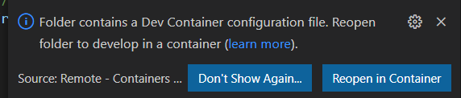
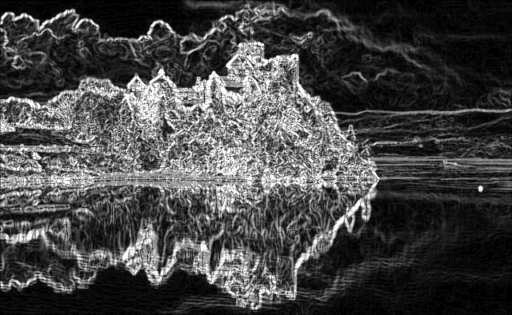
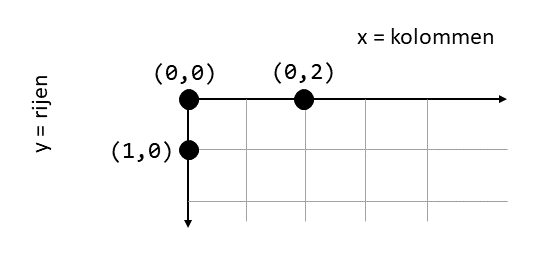
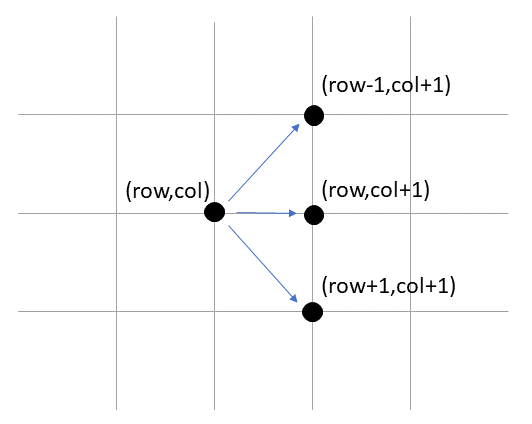

# Seam Carving

## Voorbereiding

In dit labo gaan we een afbeeldingen bewerken. Hiervoor maken we gebruik van [OpenCV](https://opencv.org/).

Voer het volgende commando uit om de nodige bibliotheken en headers te installeren:

```bash
$ sudo apt install libopencv-dev --no-install-recommends
```

Alternatief kan je gebruik maken van een VSCode Devcontainer. Klik daarvoor op "Reopen in Container" in de popup die verschijnt wanneer je VSCode opent:



## Inleiding

Seam Carving is een techniek om het formaat van afbeeldingen aan te passen rekening houdende met de inhoud van de afbeelding (context-aware resizing).

Hiervoor wordt er gezocht achter de minst opvallende naad (seam) die horizontaal (of verticaal) door beeld loopt van 1 pixel breed, om deze vervolgens te verwijderen. 

[Hier](afbeeldingen/seam.webp) zie je een animatie waarbij de naad telkens in zwart wordt aangeduid, en vervolgens wordt verwijderd.


Voor het bepalen van de naad moeten we op zoek gaan naar de minst opvallende reeks pixels die horizontaal (of verticaal) door beeld lopen en met elkaar verbonden zijn. Hiervoor krijgen jullie de functie `create_energy_image` gegeven die een "Edge detection" algoritme toepast op de afbeelding, waardoor je een energie-afbeelding krijgt waarop de gedetecteerde randen wit worden aangeduid, en minder interessante gebieden grijs tot zwart zijn.



Deze functie geeft een [`cv::Mat`](https://docs.opencv.org/4.2.0/d3/d63/classcv_1_1Mat.html) object terug met als type [`CV_8UC1`](https://docs.opencv.org/4.2.0/d1/d1b/group__core__hal__interface.html#ga81df635441b21f532fdace401e04f588). Eenvoudig gesteld is een matrix waarbij elke cel een waarde heeft tussen 0 en 255 (C1 = 1 channel, 8U=1bit).

De belangrijkste zaken die je nodig hebt om deze matrix te manipuleren:

```cpp
Mat energy_image = create_energy_image(orig_image);

energy_image.rows //aantal rijen in de matrix
energy_image.cols //aantal kolommen in de matrix

// een expliciete cast naar int is nodig!
int waarde = (int)energy_image.at<uchar>(row,col);
```

**Pas op**: We gebruiken in dit practicum de conventie van OpenCV, waarbij rijen eerst worden vermeld in een coordinaat: `(row,col)`. Vermijd om te redeneren in termen van 'x' en 'y', want `(row,col)` komt eigenlijk overeen met `(y,x)`.




## Opgave

We implementeren eerst het algoritme van Dijkstra in [include/kortste-pad.h](include/kortste-pad.h) op een eenvoudig voorbeeld.

Hierbij geven we behalve de graaf ook een start- en eindknoopnummer door aan de functie. 
```cpp
template <RichtType RT, class Takdata>
std::list<int> shortest_path(const GraafMetTakdata<RT, Takdata>& g, int start_nr, int eind_nr)

```

Het algoritme van Dijkstra mag afgebroken worden van zodra het kortste pad naar de eindknoop gekend is. Als resultaat geef je een `std::list` terug met de knoopnummers die op het kortste pad liggen.

**Tip 1:** `std::list` bevat de functie `push_front` die in *O(1)* toelaat een waarde vooraan de lijst toe te voegen. Handig wanneer je de voorgangers van elke knoop overloopt!

**Tip 2:** Gebruik [`std::priority_queue`](https://en.cppreference.com/w/cpp/container/priority_queue) uit `<queue>` om snel de volgende knoop te vinden die je kan *settlen*. *Pas op:* deze prioriteitswachtrij zal het *grootste* element teruggeven!


Test je implementatie met de tests uit `test/test-kortste-pad.cpp` alvorens verder te gaan.

### De naad vinden in een Energy Image

Om een naad te zoeken kunnen we gebruik maken van het algoritme van Dijkstra. Hierbij vormen we de afbeelding om naar een graaf, waarbij elke knoop een pixel voorstelt. We verbinden de pixels die zich in elkaars buurt verbinden. Bij het zoeken naar een horizontale naad zullen we bijvoorbeeld elke pixel verbinden met zijn rechterboven-, rechter-, en rechteronderbuur.



Implementeer in [src/seamcarving.cpp](src/seamcarving.cpp) de functie 

```cpp
/**
 * @brief Zoekt de naad in een afbeelding
 * 
 * @param energy_image een matrix met waarden tussen 0 en 255 met dezelfde dimensies als de originele afbeelding
 * @param direction richting van de naad
 * @return std::vector<int> een lijst van kolomnummers (bij een horizontale naad) of rijnummers (bij een verticale naad) die de coordinaten van de naad aangeeft.
 */
std::vector<int> find_seam(const Mat& energy_image, SeamDirection direction);
```

Bij een horizontale naad die begint in pixels (20,0), (21,1), (21,2), (20,3), (19,4), ... dient de vector dus de waarden `[20,21,21,20,19, ...]`  te bevatten.

**Tip 1:** voeg 2 speciale knopen toe die de je altijd gebruikt als begin- en eindknoop voor de `shortest_path` functie.

**Tip 2:** Je kan uit een gegeven rij- en kolomnummer gemakkelijk een uniek knoopnummer genereren. Lambda-functies om deze omzetting te doen maken dit gemakkelijk leesbaar:

```cpp

  auto geefknoopnr = [&energy_image](int row, int col) {
    assert(row < energy_image.rows);
    assert(col < energy_image.cols);

    return row * energy_image.cols + col;
  };

  auto geefrow = [&energy_image](int knoopnr){
      return knoopnr / energy_image.cols;
  };

  auto geefcol = [&energy_image](int knoopnr){
      return knoopnr % energy_image.cols;
  };

```

**Tip 3:** Zorg dat je elke waarde uit de `energy_image` matrix juist 1x hebt toegekend aan een verbinding.

**Tip 4:** In `DEMO`-modus worden extra afbeeldingen weggeschreven zodat je de tussentijdse resultaten kan zien. vb. `image_with_seam_0.jpg` toont de afbeelding met de gevonden naad in het zwart aangeduid.


### (Hard mode - *Verplicht voor 9SP studenten*) Alternatieve methode: Dynamisch programmeren

Behalve het gebruik van een kortste pad algoritme kan er bijvoorbeeld ook gebruik worden gemaakt van *dynamisch programmeren* om de beste naad te vinden. Implementeer de functie `find_seam` opnieuw via deze methode.

Enkele aanwijzingen:

- Gebruik een matrix van het type CV_32SC1 voor je berekeningen. Hierbij kan elke cel een waarde een *signed 32 bit* getal bevatten, of nog: een C `int`.

```
Mat mat1 = Mat(energy_image.rows, energy_image.cols, CV_32SC1);

int waarde = mat1.at<int>(row,col);
```

Nog enkele andere handige functies:

```

mat1.col(colnr) // geeft de kolom `colnr` terug
mat1.row(rownr) // geeft de kolom `rownr` terug

mat1.col(0).copyTo(mat2.col(0)) // kopieert kolom 0 van `mat1` naar kolom 0 van `mat2`

```

Twijfel je over de aanpak? Overleg dan eerst met een begeleider!

## Opmerkingen

De `GaussianBlur` methode van OpenCV gebruikt in `create_energy_image` bevat een klein geheugenlek. Het is daarom normaal dat je onderstaande waarschuwing krijgt:

```
=================================================================
==27619==ERROR: LeakSanitizer: detected memory leaks

Direct leak of 1560 byte(s) in 3 object(s) allocated from:
    #0 0x7f2aff767b47 in operator new[](unsigned long) (/lib/x86_64-linux-gnu/libasan.so.5+0x10fb47)
    #1 0x7f2afc1a266f  (/lib/x86_64-linux-gnu/libtbb.so.2+0x2766f)

SUMMARY: AddressSanitizer: 1560 byte(s) leaked in 3 allocation(s).
```

Je kan de waarschuwing van specifiek dit geheugenlek onderdrukken door een environment variabele door te geven:

```bash
thijs@ibcn55:~/geval-opgaves/seam-carving/build$ LSAN_OPTIONS="suppressions=lsan_suppressions.txt" /home/thijs/geval-opgaves/seam-carving/build/sc 

...
-----------------------------------------------------
Suppressions used:
  count      bytes template
      3       1560 libtbb
-----------------------------------------------------
```

## Bronnen

[Seam carving for content-aware image resizing - S. Avidan, A. Shamir](https://dl.acm.org/doi/10.1145/1275808.1276390)

[Wikipedia: Seam Carving](https://en.wikipedia.org/wiki/Seam_carving)

## Credits

Afbeelding kasteel: Photo by [Dariusz Staniszewski](https://www.pexels.com/@dariusz-staniszewski-1425290?utm_content=attributionCopyText&utm_medium=referral&utm_source=pexels) from [Pexels](https://www.pexels.com/photo/castle-near-body-of-water-2808455/?utm_content=attributionCopyText&utm_medium=referral&utm_source=pexels)
