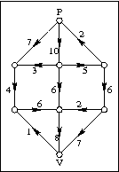

# Min cut/max flow in een stroomnetwerk

## Introductie

In een graaf kan de max-flow-min-cut-stelling gebruikt worden voor verschillende 
interessante toepassingen: om de bottleneck in een netwerk te bepalen, om vraag
en aanbod maximaal met elkaar te verbinden, enzovoort.

## Opgave

Vervolledig de implementatie voor het zoeken van de min-cut/max-flow in een stroomnetwerk. 

Je krijgt een aantal bouwstenen van ons:

In [`stroomnet.h`](include/stroomnet.h) vind je volgende klassen:

* `Stroomnetwerk<T>`: deze klasse erft over van `GraafMetTakdata<GERICHT,T>`,
en krijgt ook een `van` en `naar` knoop opgegeven. De functie `geefStroom()` geeft
een Stroomnetwerk terug waarbij de waarde van elke tak in de graaf weergeeft hoeveel
*stroom* er door die tak passert zodat de *stroom* van de `van`-knoop naar de `naar`-knoop
maximaal is. `geefCapaciteit()` geeft terug hoeveel de totale stroom tussen de twee opgegeven knopen
bedraagt.

* `Pad<T>` erft over van `vector<int>`, en bevat de knoopnummers van een pad in de graaf.
De functie `geefCapaciteit` vertelt hoeveel stroom er over dit pad kan lopen.

* `VergrotendpadZoeker` is een hulpklasse die een vergrotend pad zoekt in een stroomnetwerk.


De functie `geefStroom` ziet eruit als volgt:

```cpp
template <class T>
Stroomnetwerk<T> Stroomnetwerk<T>::geefStroom() {
  Stroomnetwerk<T> oplossing(this->aantalKnopen(), van, naar);
  Stroomnetwerk<T> restnetwerk(*this);
  Vergrotendpadzoeker<T> vg(restnetwerk);
  Pad<T> vergrotendpad = vg.geefVergrotendPad();
  while (vergrotendpad.size() != 0) {
    restnetwerk -= vergrotendpad;
    oplossing += vergrotendpad;
    vergrotendpad = vg.geefVergrotendPad();
  }
  return oplossing;
}
```

Om deze code te doen werken, moeten er 2 operators worden geimplementeerd:

```
template <class T>
Stroomnetwerk<T>& Stroomnetwerk<T>::operator-=(const Pad<T>& pad)}{

template <class T>
Stroomnetwerk<T>& Stroomnetwerk<T>::operator+=(const Pad<T>& pad)
}
```  

Test dit uit met volgende graaf:


 
## Toepassing

Bij een galadiner wil men afgevaardigden uit een aantal delegaties verdelen over de beschikbare tafels, **zodat elke delegatie verdeeld is over zoveel mogelijk tafels**.

Er zijn `D` delegaties en `T` tafels. Delegatie `i` bestaat uit `P`<sub>`i`</sub> personen. Tafel `j` heeft `Z`<sub>`j`</sub> zitplaatsen. (het aantal personen per delegatie en het aantal zitplaatsen per tafel kunnen dus verschillen) Er zijn genoeg plaatsen voor alle afgevaardigden, maar er kunnen plaatsen op overschot zijn.

Hoe kan je dit probleem beschrijven als een stroomnetwerkprobleem? Is er altijd een oplossing?

Implementeer in [`galadiner.cpp`](src/galadiner.cpp) de functie 
`vector<vector<int>> zoek_tafelverdeling(vector<int> delegaties, vector<int> tafels)` 
die als input 2 vectoren krijgt: `delegaties` bevat het aantal personen per delegatie, 
`tafels` het aantal plaatsen per tafel. De functie geeft per tafel een vector terug
met daarin de index-nummers van de delegaties waarbij een afgevaardigde een plaats geeft.

Bijvoorbeeld: `zoek_tafelverdeling({1,1,2}, {2,2})` zoekt plaatsen voor 3 delegaties aan 2 tafels. Een mogelijke uitkomst is: `{{0,2}, {1,2}}`.
