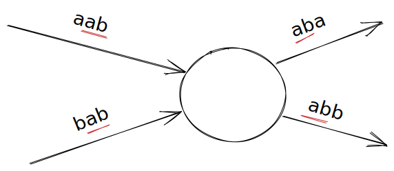

# Eulercircuits en De Bruijnreeksen

## Opgave

*   Aan welke voorwaarden moet een gerichte graaf voldoen opdat er een Eulercircuit zou bestaan? En wat voor een ongericht graaf? Tip: kijk in de cursus

    Implementeer deze voorwaarden via volgende functies in `euler.cpp`:
    
    ```cpp
    bool heeft_eulercircuit(const Graaf<ONGERICHT>& g);

    bool heeft_eulercircuit(const Graaf<GERICHT>& g);
    ```

*   Implementeer in `euler.cpp` een functie die een willekeurig Euler-circuit teruggeeft:

    ```cpp

    std::vector<int> eulercircuit(const Graaf<GERICHT>& g);
    ```

## Toepassing: De Bruijnreeksen

### Introductie

Een _de Bruijnreeks_ van orde `N` over een bepaald alfabet is de kortste _circulaire_ reeks die elke mogelijke reeks van lengte `N` als (aaneensluitende) deelreeks bevat.  
Bijvoorbeeld:

*   een de Bruijnreeks van orde `N=2` over een alfabet `{a,b}` is bijvoorbeeld "aabb" want "aa", "ab", "ba" en "bb" komen erin voor als aaneensluitende deelreeks (indien je de reeks circulair opvat!)
*   een de Bruijnreeks van orde `N=3` over een alfabet `{a,b}` is bijvoorbeeld "abbbabaa".
*   een de Bruijnreeks van orde `N=2` over een alfabet `{a,b,c}` is bijvoorbeeld "aacbbccab".

De grootte van het alfabet noemen we `M`. Vaak neemt men de eerste `M` letters van het alfabet, maar computationeel is het soms voordeliger gehele getallen vanaf 0 te nemen (alfabet: `0` t.e.m. `M-1`).

Men kan aantonen dat de lengte van elke de Bruijnreeks <code>M<sup>N</sup></code> is.

Om het ingewikkelde manipuleren met strings te vermijden is het handig om strings van lengte `N` te beschouwen als getallen met `N` cijfers in het `M`-tallig stelsel: in plaats van a, b, c, ... neem je 0, 1, 2, ... . Als `M=10` en `3`, bijvoorbeeld, heb je dan alle natuurlijke getallen nodig kleiner dan 1000 (eventueel nullen vooraan toevoegen). Als je liever letters ziet dan cijfers kan je bij het uitschrijven natuurlijk 0 terug omzetten naar a, 1 naar b, en zo voorts. De nummers zijn in feite hashcodes die efficiënt berekend kunnen worden d.m.v. de regel van Horner. Er zijn <code>M<sup>N</sup></code> mogelijke woorden van lengte `N` uit een alfabet met `M` letters. De hashcodes liggen dus in het interval <code>[0,M<sup>N</sup>[</code>.  
Omgekeerd kan uit elk getal uit dit interval een woord afgeleid worden ("unhash").


### Wat is het verband tussen De Bruijnreeksen en Eulercircuits?

We nemen het voorbeeld `N=3` voor het alfabet `{a,b}`, waarvan een geldige de Bruijnreeks "abbbabaa" is.

Als we voor elke reeks van lengte 3 een verbinding maken in een graaf, tussen welke knopen moeten deze dan lopen?

Laten we beginnen met een willekeurige verbinding te nemen, met waarde `aab`. 
Als we daar de letter `a` aan toevoegen (dus: `aaba`) dan bevat de resulterende reeks nu ook `aba`. Alternatief hadden 
we ook de letter `b` kunnen toevoegen (dus: `aabb`) zodat de resulterende reeks nu ook `abb` bevat.

Als we een de Bruijnreeks willen genereren via een Eulercircuit, dan zal je na het volgen van de verbinding `aab` dus 
ofwel de verbinding met waarde `aba` of `abb` willen kunnen volgen.

Zijn er nog reeksen die kunnen komen voor `aba` en `abb`? Ja: `bab` had hier ook voor kunnen komen.

We bekomen op deze manier dus een knoop met volgende verbindingen:



Veralgemeen dit nu. Welke waarde kan je toekennen aan de knoop om het redeneren te vereenvoudigen?
Hoe ziet het voorbeeld eruit bij `N=4` ?  

### Opgave

Implementeer in `debruijnreeks.cpp` een functie die een de Bruijnreeks genereert met de 
opgegeven alfabetlengte (waarbij het alfabet altijd start vanaf 'a') en orde. 

```cpp
std::string genereer_debruijnreeks(int lengte_alfabet, int orde){}
```

Je krijgt van ons alvast de code om gegeven `lengte_alfabet` (=`M`) en `orde` (=`N`) een nummer om te zetten naar de 
equivalente string-representatie:

```cpp
std::string nummer_naar_string(int nr, int lengte_alfabet, int orde)
{
    char *c_str = new char[orde + 1];

    c_str[orde] = '\0';
    for (int plaats_nr = orde - 1; plaats_nr >= 0; --plaats_nr)
    {
        c_str[plaats_nr] = 'a' + (nr % lengte_alfabet);
        nr /= lengte_alfabet;
    }

    std::string s{c_str};
    delete[] c_str;

    return s;
}
```
