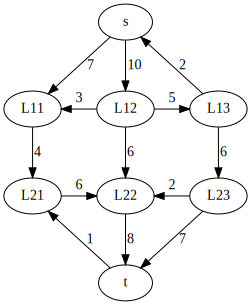
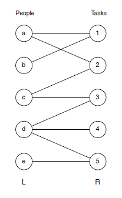
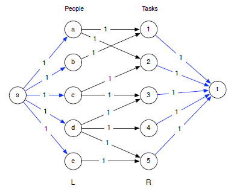

# Stroomnetwerken - Island of Sodor

## Eenvoudige opgave

1. Bekijk de klassen gedefinieerd in [`stroomnet.h`](include/stroomnet.h).

   Deze klassen zijn nog niet volledig, en niet alle functies zijn geimplementeerd. Welke functies moeten nog worden toegevoegd?

   Formuleer eerst **duidelijk** wat eventueel nog te schrijven lidfuncties allemaal veronderstellen als precondities.


2. Bekijk volgend stroomnetwerk:

   

   Los dit op, gebruik makend van breedte-eerst zoeken om een vergrotend pad te vinden.

   Je krijgt van ons [`test/eenvoudig-stroomnetwerk.cpp`](test/eenvoudig-stroomnetwerk.cpp) die bovenstaande graaf voor jou aanmaakt.

## Bipartite graaf

Je krijgt van ons een [bipartite graaf](bipartitegraaf). Het formaat van het bestand is:

- Op de eerste lijn het aantal knopen
- Op elke volgende lijn een verbinding.

1. Vorm zoveel mogelijk paren in deze graaf. Hoeveel zijn dat er? Implementeer hiervoor het algoritme dat mbv. het
   K-alternerend pad de maximum koppeling zoekt.
   
2. Controleer je antwoord door dit probleem op te lossen met behulp van een stroomnetwerk.

   Voor een gegeven bipartite graaf:
   
   
   
   Voeg 2 extra "virtuele" knopen toe: een startknoop en eindknoop. Verbind de startknoop met alle knopen uit de 
   ene verzameling. Verbind alle knopen uit de andere verzameling met de eindknoop. Maak de verbindingen van de ene 
   naar de andere verzameling gericht. Geef aan alle verbindingen capaciteit 1.
   
   Je resulterende graaf ziet er dan als volgt uit:
   
   
   
   Zoek in deze graaf de maximale stroom.
   
3. Leg het verband uit tussen beide methodes. Hoe zal een vergrotend pad eruit zien in dit stroomnetwerk? Waarom lijkt 
   dit op een K-alternerend pad?

 

## Toepassing

Het eiland van Sodor omvat een groot aantal dorpen en steden, met elkaar verbonden via een extensief spoorwegennet. 
Recent werden enkele gevallen van een zeer besmettelijke ziekte (de varkenspest of een zombievirus, de filmpjes op 
sociale media zijn erg verwarrend) geraporteerd in de gemeente Ffarquhar. De uitbater van de "Sodor railway" plant
daarom om enkele treinstations te sluiten om zo te vermijden dat de ziekte zich kan verspreiden naar zijn thuisstad
Tidmouth. Geen enkele trein kan door een gesloten station rijden. Om de kosten te beperken (en verdere paniek te 
vermijden) wil hij zo weinig mogelijk stations sluiten. Hij kan echter het station van Ffarquhar niet sluiten, 
omdat dit hem aan de ziekte zou blootstellen, net zoals het station van Tidmouth, omdat hij anders niet meer naar
zijn favoriete café kan gaan.

Beschrijf en analyseer een algoritme om het minimale aantal stations te vinden dat hij moet sluiten om alle reizen
tussen Ffarquhar en Tidmouth onmogelijk te maken.

Het spoorwegennet van Sodor is voorgesteld als een ongerichte graaf in [sodor-trainnetwork.json](sodor-trainnetwork.json).
Let op: elke verbinding wordt 2x vermeld in dit bestand.

Om dit JSON-bestand in te lezen gebruiken we de populaire bibliotheek [nlohmann/json](https://github.com/nlohmann/json). 
Je krijgt van ons de code die deze JSON-file parset en omzet naar `structs` gedefinieerd in [network-reader.h](include/network-reader.h).

1. Construeer een graaf waarmee je bovenstaande opgave kan oplossen als een klassiek stroomnetwerk-probleem. Van welke 
   eigenschap van stroomnetwerken kan je gebruik maken?

   Implementeer hiervoor volgende functie in `sodor.cpp`:

   ```cpp
   int zoekMinimaleStationsluitingen(const std::vector<sodor::TrainStation> &stations,
                                    const std::string &startStationNaam, const std::string &eindStationNaam);
   ```


2. **Bonusopgave:** geef een lijst terug met de namen van de stations die dienen gesloten te worden. Definieer 
   hiervoor zelf de nodige extra functies.


#### Bronnen

[Jeff Erickson - CS 473: Algorithms](https://jeffe.cs.illinois.edu/)
