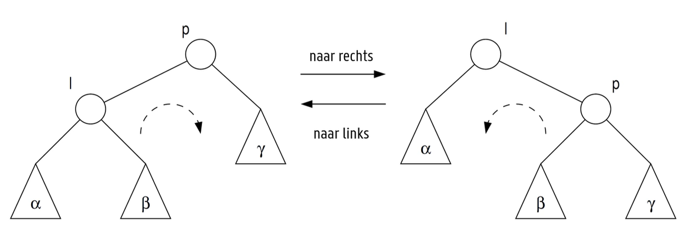

# Labo 04: Rood-Zwarte bomen

Een van de mogelijkheden om data op te slaan zijn binaire zoekbomen. Deze zoekbomen hebben echter het grote nadeel dat ze in bepaald scenarios niet evenwichtig gevormd zullen worden: de efficientie van zoekopdrachten is afhankelijk van de diepte van dergelijke boom. Een oplossing voor dit probleem zijn de Rood-Zwarte bomen die mechanismen bevatten om de hoogte te beperken. 

Voor de start van het labo maak je een kopie de repository naar je eigen GitHub account (1 per groep). Een handleiding hiervoor vind je in [`Repository.md`](Repository.md).

## De startcode

Voor deze implementatie zijn er 2 klasses gegeven in [`rzwknoop.h`](include/rzwknoop.h) en [`rzwboom.h`](include/rzwboom.h).

Analyseer vooraleer je begint eerst grondig deze 2 bestanden. Wat is de relatie tussen `RZWboom`, `RZWknoop` en `unique_ptr`? 
Hoe vraag je vanuit een `RZWboom`-object gegevens op uit de onderliggende `RZWknoop`? 
Wat doet `if(*this)` uit de functie `inorder` ?
Waarvoor dient de functie `geefBoomVanKnoop` ? 

Herhaal indien nodig de concepten van `unique_ptr` en hoe de functies `make_unique` en `move` werken vooraleer je aan dit labo start.

*Tip*: Je kan de bomen tijdens dit labo exporteren en bekijken via de functie `tekenBinair` en met behulp van de extensie [Graphviz (dot) language support for Visual Studio Code](https://marketplace.visualstudio.com/items?itemName=joaompinto.vscode-graphviz) ook weergeven in VSCode.

## Basisoperaties Rood-Zwarte boom

Als eerste zullen er enkele basisoperaties toegevoegd moeten worden aan de klasse `RZWBoom`:

1. Implementeer in de klasse `RZWBoom` de functie `zoek` die een sleutel kan opzoeken in de boom.
2. Na het toevoegen van een nieuwe knoop aan de boom zal je het rood-zwarte evenwicht van de boom terug moeten herstellen door rotaties van de boom. Hiervoor schrijf je nu al best de functie `roteer`. Om te redeneren welke pointers aangepast moeten worden gebruik je best volgende figuur:

3. Voeg nu knopen "bottom-up" toe aan de rood-zwarte boom, via de functie `voegtoe`.

   *Tip*: maak hier gebruik van de functies `zoek` en `roteer`.

## Toepassing

Een bibliotheek is van plan om een digitale zoekcatalogus te maken van alle woorden in hun boeken en teksten. Aangezien er geen controle is over de volgorde van toevoegen van woorden en ze het aantal operaties per zoekopdracht willen beperken, kiezen ze om een rood-zwarte boom te maken per boek.

1. Het testen of deze aanpak goed zal werken doen we met de tekst van Ovidius. Bij het aanmaken lezen we alle woorden in, kijken of ze al in de boom zitten en voegen niet-duplicate sleutels toe. In hoeveel stappen kan er achteraf bepaald worden of een bepaald woord in de tekst zit?

2. **Bonusopgave:** Omdat sommige zoektermen weinig meerwaarde bieden of te expliciet zijn, zou de bibliotheek woorden kunnen verwijderen uit de zoekboom van het boek. Hierbij moet het rood-zwarte evenwicht ook behouden blijven.

3. **Bonusopgave:** De bibliotheek krijgt veel vragen van klanten hoe vaak sommige woorden voorkomen in een tekst. Pas de template aan, zodat je ook naast `Sleutel sleutel` ook `Data data` kan bijhouden in de knopen.
