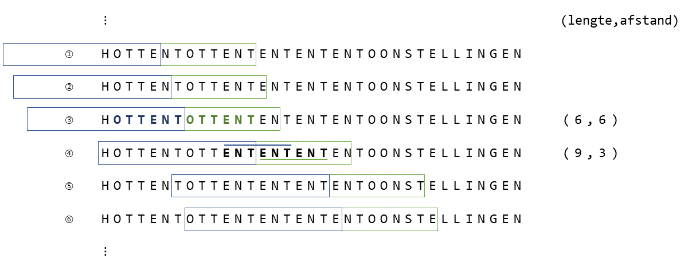

# DEFLATE

## Introductie

Een van de meest courante compressiealgoritmen is DEFLATE. Dit algoritme werd oorspronkelijk 
ontwikkeld voor gebruik in `.zip`-bestanden. Omdat het ook mogelijk bleek om DEFLATE-bestanden 
aan te maken op manieren die niet gepatenteerd waren door de bedenker, won het al vrij snel 
aan populariteit. Vandaag de dag kan je het DEFLATE-algoritme onder andere terug vinden in 
*gzip* (de `.gz` uit `.tar.gz` bestanden!) en in het *Portable Network Graphics* (`.png`) 
bestandsformaat.

DEFLATE gebruikt een combinatie van twee technieken:

1. Het elimineren van stukken string die meermaals voorkomen mbv. *Lempel-Ziv*
2. Reductie van benodigde bits mbv *Huffman encodering*

We concenteren ons vandaag op het elimineren van stukken strings die meermaals voorkomen mbv. 
*Lempel-Ziv*, en meer concreet: de variant *LZ77* die werkt met een *sliding window*.

### LZ77

Bij LZ77 worden herhalingen van stukken tekst vervangen door een lengte-afstand-paar die aangeeft
hoe lang het stuk tekst is dat herhaald wordt, en welke afstand hiervoor moet worden teruggekeken
in de tekst.

Omdat het niet haalbaar of wenselijk is om alle eerder geziene tekst bij te houden in het geheugen
wordt dit typisch beperkt tot een *search buffer* die de laatste 2kB, 4kB of 32 kB verwerkte tekst
bevat.
Daarnaast hebben we ook een *look ahead buffer*. Deze volgt direct na de *search buffer* en bevat de
tekst die nog moet worden geëncodeerd. Na elke stap schuiven ze samen op in de tekst. Op deze manier
vormen ze samen een *sliding window*.

In elke stap zoekt LZ77 of er een prefix van de *look-ahead* buffer ook eerder in de *sliding window*
voorkomt, startende in de *search buffer*.
Indien dat het geval is, dan wordt deze prefix vervangen door een lengte-afstand-paar. Prefixen van
3 of minder karakters worden genegeerd.

We comprimeren het woord "HOTTENTOTTENTENTENTENTOONSTELLINGEN" met LZ77 als voorbeeld:



Het algoritme vindt 2 maal een prefix terug van de *look ahead buffer*: op lijnen ③ en ④. 
De prefix "ENT" op lijn ⑤ wordt genegeerd omdat ze slechts 3 karakters lang is.

Het geëncodeerde resultaat is: `H O T T E N T (6,6) (9,3) O O N S T E L L I N G E N`.

## Opgave

Je krijgt van ons een werkende implementatie van zowel een LZ77-compressie als een LZ77-decompressie methode.

De compressiemethode `compress_lz77` uit [lz77.cpp](src/lz77.cpp) heeft nood aan een performante manier om
herhalingen in de tekst te zoeken. 

In dit labo zullen we deze zoek-functie implementeren met behulp van suffixtabellen.

Je krijgt daarvoor van ons een klasse [SuffixArray](include/suffix_array.h) die een suffixtabel opstelt 
(adhv. het Suffix Array by Induced Sorting-algoritme).

Geven we bijvoorbeeld het woord "ABRACADABRA" mee, dan construeert deze klasse een vector met als waarden:

`10 7 0 3 5 8 1 4 6 9 2 `

Dit komt overeen met de begin-indexen van de respectievelijke suffixen:


| Startindex | Effectieve suffix |
|------------|-------------------|
| 10         | A                 |
| 7          | ABRA              |
| 0          | ABRACADABRA       |
| 3          | ACADABRA          |
| 5          | ADABRA            |
| 8          | BRA               |
| 1          | BRACADABRA        |
| 4          | CADABRA           |
| 6          | DABRA             |
| 9          | RA                |
| 2          | RACADABRA         |

Ter referentie:

|0|1|2|3|4|5|6|7|8|9|10|
|-|-|-|-|-|-|-|-|-|-|--|
|A|B|R|A|C|A|D|A|B|R|A |


Implementeer de volgende functie: 

```cpp 
/**
 * Zoek de langste substring in de search buffer + lookahead buffer die start in de search buffer en
 * die een prefix is in de lookahead buffer (waarbij + string concatenatie voorstelt). 
 * Prefixen van 3 of minder karakters worden genegeerd.
 * 
 * @param search_buffer_begin de index waar de *search buffer* (en dus ook het *sliding window* begint)
 * 
 * @param search_buffer_lengte het aantal karakters in de *search buffer*
 * 
 * @param lookahead_buffer_lengte het aantal karakters in de *lookahead buffer* 
 *        (search_buffer_lengte + lookahead_buffer_lengte == sliding_window_lengte)
 * @returns een (lengte, afstand) paar, waarbij `lengte` de lengte van de gematchte substring teruggeeft, 
 *          en `afstand` het aantal karakters dat moet worden teruggekeerd in de search buffer om tot de start
 *          van de gematchte substring te komen. `lengte = 0` indien er geen match is van minstens 4 karakters lang. 
 */
std::pair<int, int> zoekHerhaling(size_t search_buffer_begin, size_t search_buffer_lengte, size_t lookahead_buffer_lengte){}

```


**TIP**: om deze functie gemakkelijk te kunnen implementeren heb je al zeker een extra hulptabel `LCP` nodig. Voeg deze toe 
aan de klasse `SuffixArray` en initialiseer de tabel in de constructor. Heb je nog andere hulptabellen nodig? Voeg ze dan ook toe.

